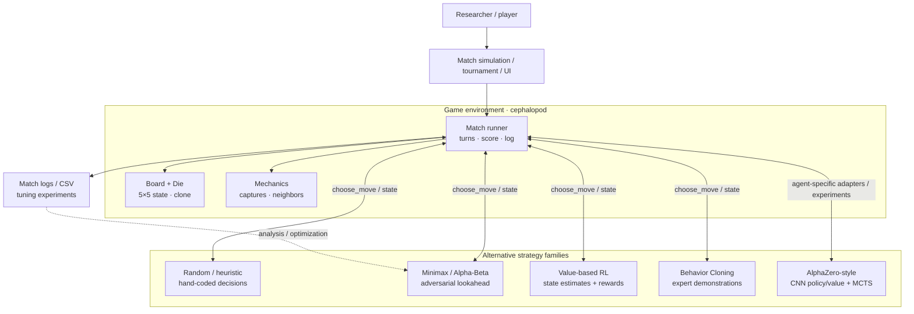
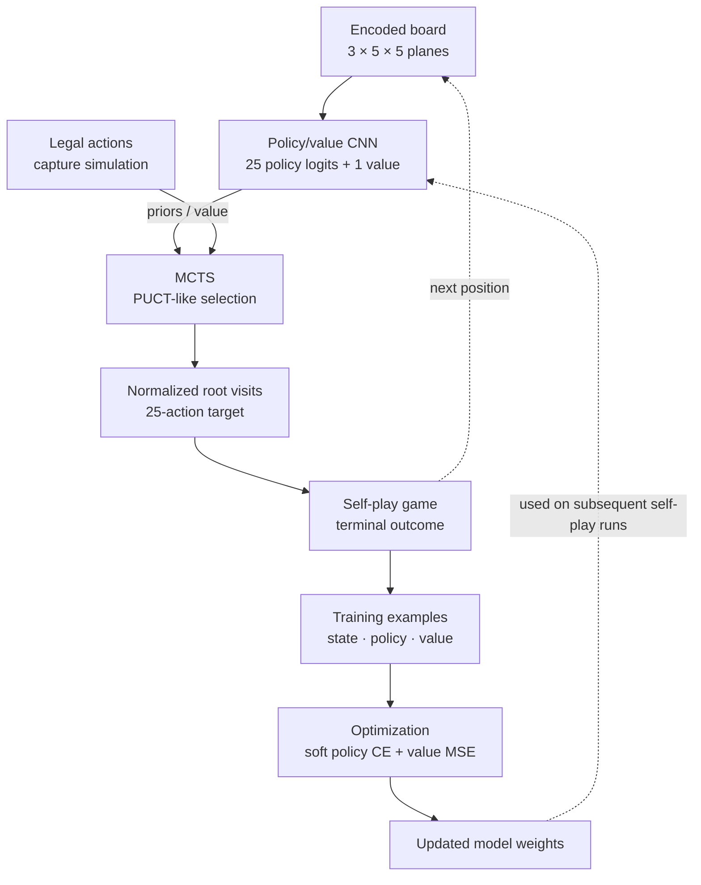

# IA_Cephalopod — System Design

> **One game, several ways to make decisions.** A multi-paradigm AI experimentation project, from rule-based strategies and adversarial search to value-based learning, imitation and neural-guided Monte Carlo Tree Search.
>
> [Repository overview](../README.md) · [Walkthrough and interview guide (Italian)](PROJECT_WALKTHROUGH_IT.md)

## 1. Motivation: why build this?

A turn-based strategy game makes a useful, observable decision environment: each agent receives a board state, must choose an action under known rules, and obtains a measurable outcome.

The project's central question is **how different AI techniques decide under the same game constraints**. A handcrafted policy can be fast but short-sighted; Minimax can reason about opponents but becomes expensive with depth; learning-based agents replace some hand-designed decision logic with experience or examples; neural-guided search combines both prediction and planning.

The goal is **to explore and implement these approaches**, not to claim that the neural approach necessarily outperforms the others. A controlled cross-paradigm benchmark still requires additional experimental standardization.

## 2. The problem and the game

The main environment uses a **5 × 5 board**. Each occupied cell holds a die with an owner (B or W) and a top-face value. Players alternate turns, selecting an empty position. Depending on orthogonally adjacent dice, placing a die may capture a subset of **at least two** neighbors whose pip sum is at most **6**. Captured dice are removed and the new die's top face becomes the captured pip sum; without capture, its top face is **1**.

The main game runner ends when the board is full or a player cannot supply a move. It determines the winner by **number of dice owned**, with ties represented as `DRAW`. This is a description of the implementation, not a complete formal specification of every historical variant.

A strategy is represented by an object supporting the method `choose_move(board, color)`. The expected result is `(row, column, top_face, captured_positions)`. It is a **duck-typed convention**, not a single formally enforced abstract class across all experiments.

## 3. System context: the main experimental framework

This is a **component map**, not a sequential processing pipeline. Different algorithms can act as alternative players in a match.

**Important architecture boundary:** these agents have been developed in different modules and experimental variants. The diagram shows **conceptual families and shared game ideas**, not a proven plug-and-play API for every neural and search implementation. In particular, AlphaZero self-play uses its own board simulation path; Behavior Cloning evaluation and the `ia_scarc/` tree also contain separate adapters or implementations.

### Code ownership

| Subsystem | Role | Source |
| --- | --- | --- |
| Board & dice | Store occupied cells and top-face values; clone states and list empty cells | [`core/board.py`](../cephalopod/core/board.py) |
| Capture mechanics | Find neighboring subsets and choose one; calculate capture sum | [`core/mechanics.py`](../cephalopod/core/mechanics.py) |
| Match runner | Request actions from both strategies, apply moves, log outcome | [`game_modes/cephalopod_game_dynamic.py`](../cephalopod/game_modes/cephalopod_game_dynamic.py) |
| Heuristics & search | Choose moves from immediate or lookahead evaluations | [`strategies/`](../cephalopod/strategies/) |
| Value-based RL | Evaluate candidate successor states and update stored values using shaped rewards | [`RL/base_rl_player.py`](../cephalopod/RL/base_rl_player.py) |
| Behavior Cloning | Turn expert state/action examples into a supervised model | [`clon/`](../cephalopod/clon/) |
| AlphaZero-style | Train a policy/value CNN from neural-guided MCTS self-play | [`alphazero/`](../cephalopod/alphazero/) |
| Match experiments | Simulate matches, save CSV and tune strategy configurations | [`simulazioni/`](../cephalopod/simulazioni/), [`ui/tuning_optuna.py`](../cephalopod/ui/tuning_optuna.py) |
| Historical second implementation | Additional game, MCTS, Alpha-Beta and Optuna experiments | [`ia_scarc/`](../ia_scarc/) |

## 4. Why each decision approach?

| Family | How decisions are made here | Motivation | Trade-off / implementation caveat |
| --- | --- | --- | --- |
| Random / greedy heuristics | Select an empty position, often preferring favorable immediate captures | Establish simple reference behavior and transparent rules | Low cost, but limited anticipation of the opponent |
| Minimax + Alpha-Beta | Simulate alternating moves to a depth cutoff and score boards with a heuristic | Account for the opponent's best response | Exponential tree growth; quality depends on cutoff, move filtering and evaluation weights |
| Search weight tuning | Evaluate different heuristic weights through repeated matches / Optuna scripts | Replace purely manual parameter choice with empirical optimization | Sensitive to opponent pool, randomness and match protocol |
| Value-based RL | Use ε-greedy exploration and learned values for resulting states, with reward shaping | Learn preferences from repeated gameplay | May generalize poorly across unseen board states; the implementation stores **successor-state values**, not a standard deep Q-network |
| Behavior Cloning | Train a CNN with supervised expert state/action examples | Learn from a stronger handcrafted/search policy without discovering behavior from scratch | Predictions are continuous row/column/face values, followed by rounding/fallback; legality and generalization need evaluation |
| AlphaZero-style neural MCTS | Use a policy/value CNN to guide PUCT-like search, generate self-play targets and retrain | Combine model-based lookahead with learned priors and outcomes | A research prototype, **not a validated reproduction of full AlphaZero**; old checkpoint weights were not retrained after recent algorithm corrections |

### What is comparable, and what is not?

In principle, the approaches can be evaluated on common match conditions: same rules, controlled opening positions, alternate colors, controlled compute budgets, fixed checkpoints, same handling of draws and enough games to estimate uncertainty.

The tracked CSV files, Optuna configurations and neural checkpoints are **historical experimental artifacts**, not proof of a controlled head-to-head benchmark across *all* families. Some scripts treat results differently (one legacy summary counts a draw as a win for White), and alternate implementations do not yet share a completely formalized game-state/action interface.

## 5. Zoom-in: the AlphaZero-style learning loop

Unlike ordinary Minimax, neural-guided MCTS evaluates candidate branches with a model that predicts **policy priors** and a **position value**. MCTS visit counts become a policy target; the final game outcome is used for the value target.

This diagram summarizes the **intended data/learning cycle** represented by the code. It is not a claim that a fully automated multi-iteration training-and-evaluation loop, model-gating stage or tournament evaluation is implemented.

The concrete implementation includes:
- `encode_board()`: planes encode current-player occupancy and dice values relative to the acting player.
- `NeuralNetwork`: a small 3-layer convolutional network with separate policy (25 logits) and value (tanh scalar) heads.
- `MCTS`: expands legal empty positions, uses policy priors and estimated value, and outputs a normalized visit distribution.
- `generate_self_play_data()` / `play_game()`: runs self-play and produces state/policy/outcome records.
- `train()`: updates the CNN using soft policy-distribution targets and an MSE value loss.

Source: [`cephalopod/alphazero/`](../cephalopod/alphazero/).

**Naming precision:** call this an *AlphaZero-style prototype*. It does not demonstrate every feature of production AlphaZero (such as systematic checkpoint gating, tournament validation, symmetry augmentation or a fully controlled training schedule).

## 6. Experiment architecture and evaluation principles

Two useful evaluation perspectives:

1. **Playing strength:** wins, losses and draws against baseline opponents, under controlled roles/color assignment and multiple seeds.
2. **Cost and behavior:** decision latency, search depth/simulations, tactical captures, invalid-move rate and robustness to different starting states.

For meaningful comparisons, a future protocol should freeze:
- the authoritative rule engine and strategy/action contract;
- opponents, number of games, seed/opening positions and both color assignments;
- neural checkpoints, search budget and machine environment;
- draw handling, CSV schema and report aggregation.

**Current evidence:** the repository includes match scripts, CSVs, tuned configurations and tracked neural checkpoint files, plus unit/smoke tests. We should not infer superiority, win rates or reproducibility from filenames alone; the historical match protocol and saved checkpoint versions must first be reconciled.

## 7. Known limits and defensible next steps

- **Separate variants:** `cephalopod/` and `ia_scarc/` are related but not one canonical, automatically compatible engine.
- **Rule consistency:** previous corrections aligned the AlphaZero capture value to the main engine. Not every historical script has been audited against that engine.
- **Strategy interface:** the `choose_move(board, color)` convention is broad, but some neural implementations need adapters.
- **Evaluation bias:** some historical comparison scripts fix color or count draws incorrectly, so results need careful regeneration.
- **Behavior Cloning:** continuous action regression plus fallback is not the same as a masked categorical policy over legal moves.
- **Training integrity:** saved neural weights were not retrained after recent rules/training updates.
- **Testing:** existing tests cover several core and neural smoke cases; not every UI, tournament, RL or legacy program is included.

### Suggested future improvements (not currently claimed)

Define a single validated `GameState` / `Move` API, add a rule-consistency test suite for all agent adapters, build a common benchmark harness (alternating colors and confidence intervals), and retrain/evaluate neural agents under a fixed protocol.

## 8. Interview narrative in one paragraph

> I used a turn-based strategy game as a controlled decision environment to explore several AI approaches. Starting with heuristics and adversarial search, I examined the trade-off between lookahead quality and computation; I then implemented learning-based alternatives, including successor-state value learning, supervised imitation of an expert policy, and an AlphaZero-style policy/value network combined with Monte Carlo Tree Search. The common thread is not that one method is necessarily best, but **how the source of a decision changes: manually designed rules, explicit search, past experience, expert examples, or neural estimates guiding search**.

Read [`PROJECT_WALKTHROUGH_IT.md`](PROJECT_WALKTHROUGH_IT.md) for a natural Italian explanation and interview Q&A.
